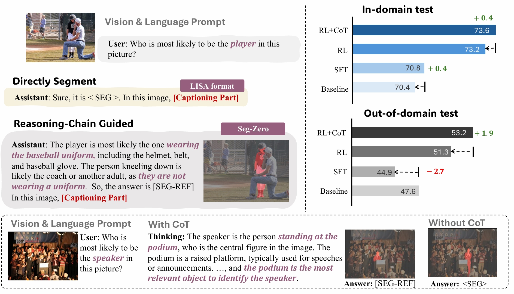
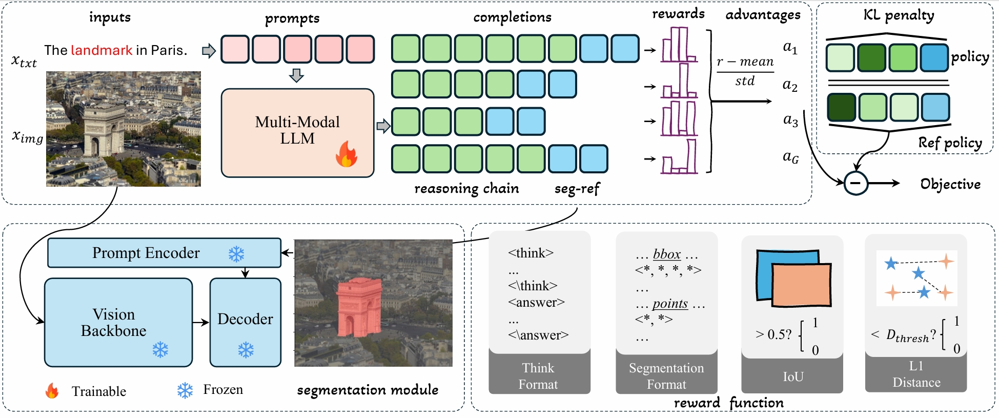
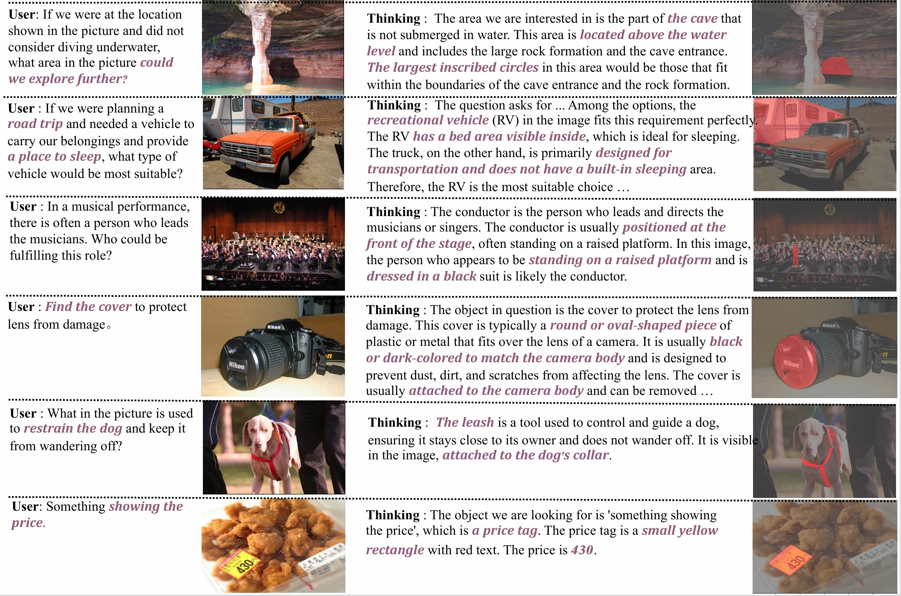
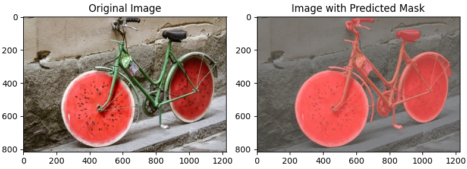
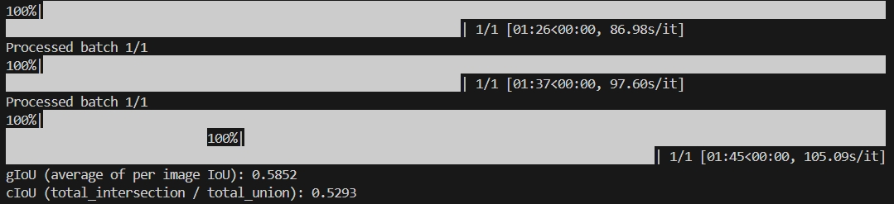
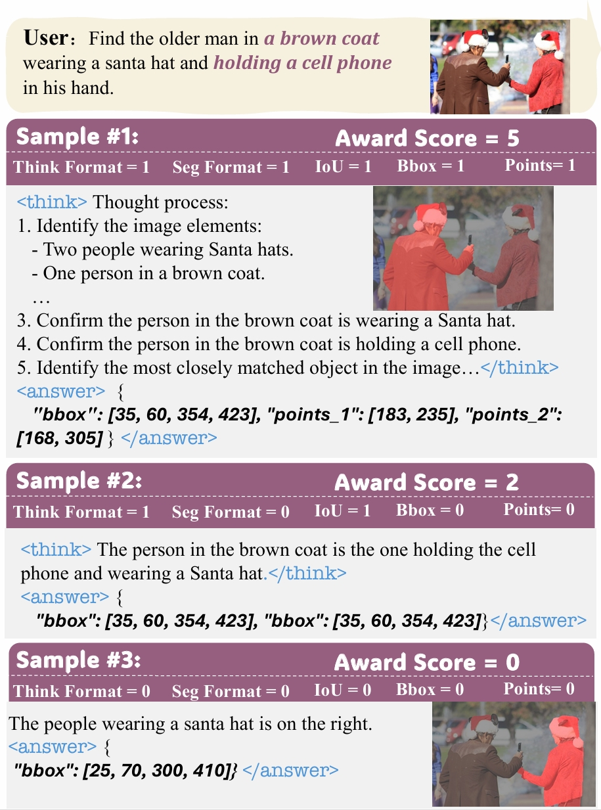

# Seg-Zero: Reasoning-Chain Guided  Segmentation via Cognitive Reinforcement

Paper: [📖 Seg-Zero](https://arxiv.org/abs/2503.06520)   
HuggingFace Daily: [🤗 Seg-Zero](https://huggingface.co/papers/2503.06520)  
Data: [🤗 RefCOCOg-2K](https://huggingface.co/datasets/Ricky06662/refCOCOg_2k_840)   [🤗 RefCOCOg-9K](https://huggingface.co/datasets/Ricky06662/refCOCOg_9k_840)   [🤗 ReasonSeg-Test](https://huggingface.co/datasets/Ricky06662/ReasonSeg_test)  [🤗 ReasonSeg-Val](https://huggingface.co/datasets/Ricky06662/ReasonSeg_val)    
Model: [🤗 Seg-Zero-7B](https://huggingface.co/Ricky06662/Seg-Zero-7B)   [🤗 Seg-Zero-7B-Best-on-ReasonSeg-Test](https://huggingface.co/Ricky06662/Seg-Zero-7B-Best-on-ReasonSegTest)

Overview of Seg-Zero:

<div align=center>

</div>

Seg-Zero demonstrates following features:
1. Seg-Zero exhibits emergent test-time reasoning ability. It generates a reasoning chain before producing the final segmentation mask. 
2. Seg-Zero is trained exclusively using reinforcement learning, without any explicit supervised reasoning data.
3. Compared to supervised fine-tuning, our Seg-Zero achieves superior performance on both in-domain and out-of-domain data.

**Highlight Code Features**:
1. This code is based on the [EasyR1](https://github.com/hiyouga/EasyR1) and [veRL](https://github.com/volcengine/verl), which supports model split during sampling and is more GPU memory friendly.
2. Supporting both Qwen2-VL and Qwen2.5-VL series models.
3. Already implementing commonly used rewards in Object Detection and Object Segmentation, including IoU reward and L1 reward. 


## News

[March 11th, 2025] 🔥 [Paper](https://arxiv.org/abs/2503.06520) is coming!   
[March 8th, 2025] 🔥 Seg-Zero is coming! We have released the code and training data.


## Contents
- [Model](#model)
- [Examples](#examples)
- [Installation](#installation)
- [Inference](#inference)
- [Evaluation](#evaluation)
- [Training](#training)
- [Citation](#citation)
- [Acknowledgement](#acknowledgement)


## Model
<div align=center>

</div>

Seg-Zero employs a decoupled architecture, including a reasoning model and segmentation model. We manually design a sophiscated reward mechanism that integrates both the format and accuracy rewards.


## Examples

<div align=center>

</div>


## Installation

```bash
git clone https://github.com/dvlab-research/Seg-Zero.git
cd Seg-Zero
conda create -n seg_zero python=3.11
conda activate seg_zero
pip install torch==2.5.1 torchvision==0.20.1 torchaudio==2.5.1
pip install -e .
pip install sam2
pip install matplotlib
```


## Inference
```bash
python inference_scripts/infer.py
```
The default question is 
> "the unusal object in the image."

You will get the thinking process in command line, like:

> "The image shows a bicycle with wheels that have been replaced with large, round objects resembling watermelon slices. The unusual aspect of the image is the substitution of the bicycle wheels with these watermelon-like objects, which is not a typical feature of a bicycle. The rest of the bicycle appears to be a standard design, but the wheels are the focal point of the image."

And the mask will be presented in **inference_scripts** folder. 

<div align=center>

</div>

You can also provide your own image_path and text by:
```bash
python inference_scripts/infer.py --image_path "your_image_path" --text "your question text"
```

## Evaluation  

```bash
bash evaluation_scripts/eval_reasonseg.sh
```  
Adjusting '--batch_size' in the bash scripts based on your GPU. And you will see the gIoU and cIoU in your command line.  
<div align=center>

</div>    

> [!NOTE]
> The best performance on different datasets is achieved using different checkpoints. We release the best performing checkpoint on ReasonSeg-test, and the best results on ReasonSeg-val is using another checkpoint.    

## Training

### 1. GRPO Training

```bash
bash training_scripts/run_qwen2_5_3b_refCOCOg.sh
```
You can try change the following hyper-parameters if you have a large GPU memory.
```bash
worker.actor.micro_batch_size_per_device_for_update=4 or 8 or 16 \
worker.actor.micro_batch_size_per_device_for_experience=4 or 8 or 16 \
```
If your GPU has less memory, you can change the following config. The number is depend on your GPU memory.
```bash
worker.rollout.tensor_parallel_size=[your number between 1-8]
worker.rollout.gpu_memory_utilization=[your number between 0-1]
worker.rollout.n=[your number between 4-32]
```

### 2. Merge Checkpoint in Hugging Face Format

```bash
python3 training_scripts/model_merger.py --local_dir [path_to_your_actor_checkpoint]
```

> [!TIP]
> If you encounter issues with connecting to Hugging Face, consider using `export HF_ENDPOINT=https://hf-mirror.com`.


## The GRPO Algorithm

<div align=center>

</div>

Seg-Zero generates several samples, calculates the rewards and then optimizes towards samples that achieve higher rewards.

> [!TIP]
> To learn more about the GRPO algorithm, you can refer to [Hugging Face's blog](https://huggingface.co/docs/trl/v0.15.2/en/grpo_trainer).


## Citation

```bibtex
@article{liu2025segzero,
  title        = {Seg-Zero: Reasoning-Chain Guided  Segmentation via Cognitive Reinforcement},
  author       = {Liu, Yuqi and Peng, Bohao and Zhong, Zhisheng and Yue, Zihao and Lu, Fanbin and Yu, Bei and Jia, Jiaya},
  journal      = {arXiv preprint arXiv:2503.06520},
  year         = {2025}
}

```
<!-- @misc{liu2025segzero,
  title        = {Seg-Zero: Reasoning-Chain Guided  Segmentation via Cognitive Reinforcement},
  author       = {Liu, Yuqi and Peng, Bohao and Zhong, Zhisheng and Yue, Zihao and Lu, Fanbin and Yu, Bei and Jia, Jiaya},
  howpublished = {\url{https://github.com/dvlab-research/Seg-Zero}},
  year         = {2025}
} -->

## Acknowledgement
We would like to thank the following repos for their great work: 

- This work is built upon the [EasyR1](https://github.com/hiyouga/EasyR1) and [veRL](https://github.com/volcengine/verl).
- This work utilizes models from  [Qwen2-VL](https://huggingface.co/Qwen/Qwen2-VL-2B-Instruct), [Qwen2.5-VL](https://huggingface.co/Qwen/Qwen2.5-VL-3B-Instruct) and [SAM2](https://huggingface.co/facebook/sam2-hiera-large). 


## Star History

[](https://star-history.com/#dvlab-research/Seg-Zero&Date)